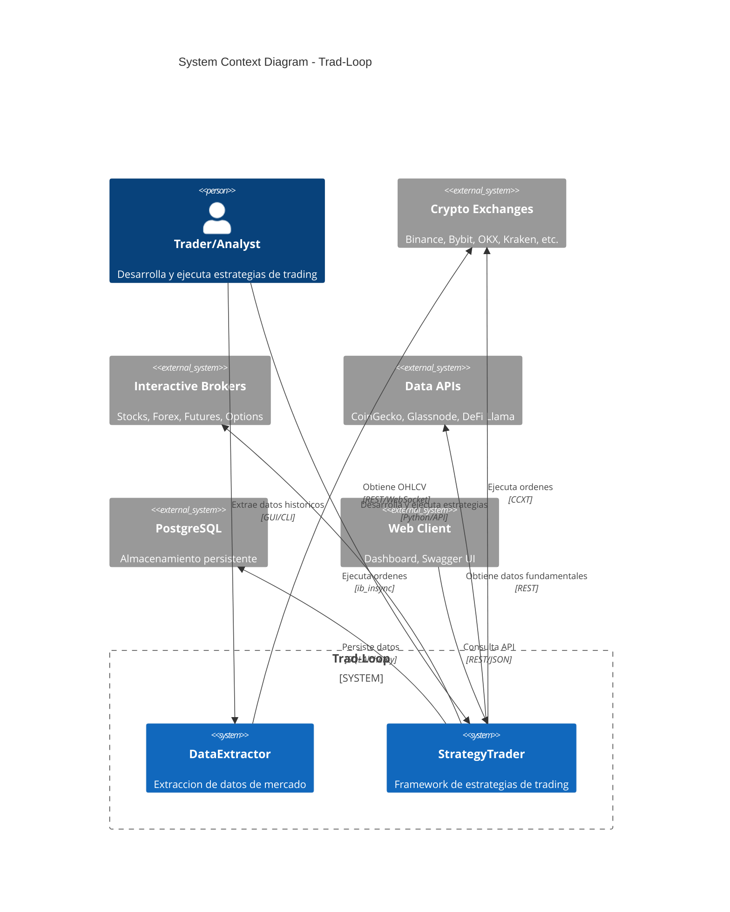
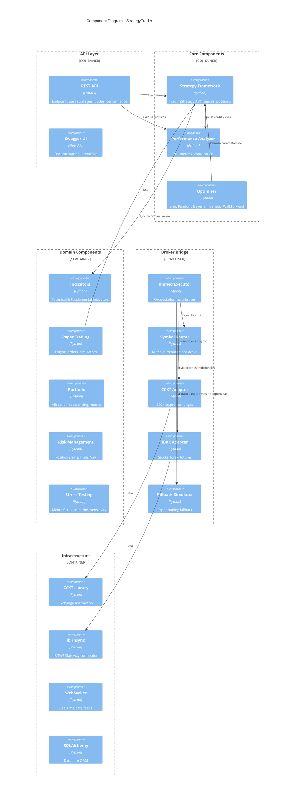

# Manual Tecnico - Trad-Loop

## Indice

1. [Vision General](#1-vision-general)
2. [Diagrama C2 - Contexto del Sistema](#2-diagrama-c2---contexto-del-sistema)
3. [Diagrama C3 - Componentes](#3-diagrama-c3---componentes)
4. [Arquitectura por Modulo](#4-arquitectura-por-modulo)
5. [Flujos de Datos](#5-flujos-de-datos)
6. [Patrones de Diseno](#6-patrones-de-diseno)
7. [Dependencias Externas](#7-dependencias-externas)
8. [Estructura de Tests](#8-estructura-de-tests)

---

## 1. Vision General

**Trad-Loop** es un framework de trading algoritmico profesional compuesto por dos sistemas principales:

| Sistema | Proposito | Tecnologia |
|---------|-----------|------------|
| **DataExtractor** | Extraccion de datos de mercado | Clean Architecture, Tkinter GUI |
| **StrategyTrader** | Desarrollo y ejecucion de estrategias | Modular, FastAPI, Async |

### Metricas del Proyecto

- **Lineas de codigo**: ~34,000
- **Tests**: ~500+
- **Modulos**: 10 principales
- **Exchanges soportados**: 100+ (via CCXT)

---

## 2. Diagrama C2 - Contexto del Sistema

El diagrama de contexto muestra como Trad-Loop interactua con sistemas externos y usuarios.

```
┌─────────────────────────────────────────────────────────────────────────────────┐
│                                   CONTEXTO                                       │
│                                                                                  │
│  ┌──────────────┐                                           ┌──────────────┐    │
│  │   Trader/    │                                           │   Exchanges  │    │
│  │  Analista    │                                           │   Crypto     │    │
│  │              │                                           │  (Binance,   │    │
│  │  [Persona]   │                                           │  Bybit, OKX) │    │
│  └──────┬───────┘                                           └──────┬───────┘    │
│         │                                                          │            │
│         │ Desarrolla estrategias                      Market Data, │            │
│         │ Analiza resultados                          Order Exec   │            │
│         │ Ejecuta trades                                           │            │
│         ▼                                                          ▼            │
│  ┌─────────────────────────────────────────────────────────────────────────┐   │
│  │                                                                          │   │
│  │                           TRAD-LOOP                                      │   │
│  │                                                                          │   │
│  │   ┌─────────────────┐              ┌─────────────────────────────────┐  │   │
│  │   │  DataExtractor  │─────────────▶│        StrategyTrader           │  │   │
│  │   │                 │   CSV Data   │                                 │  │   │
│  │   │  - GUI (Tkinter)│              │  - Backtesting                  │  │   │
│  │   │  - CLI          │              │  - Optimization                 │  │   │
│  │   │  - Exchanges    │              │  - Paper Trading                │  │   │
│  │   └─────────────────┘              │  - Live Execution               │  │   │
│  │                                    │  - REST API                     │  │   │
│  │                                    └─────────────────────────────────┘  │   │
│  │                                                                          │   │
│  └─────────────────────────────────────────────────────────────────────────┘   │
│         │                                                          │            │
│         │                                                          │            │
│         ▼                                                          ▼            │
│  ┌──────────────┐      ┌──────────────┐      ┌──────────────┐  ┌──────────────┐│
│  │  PostgreSQL  │      │  Data APIs   │      │ Interactive  │  │  Web Client  ││
│  │   Database   │      │  (CoinGecko, │      │   Brokers    │  │  (Dashboard) ││
│  │              │      │  Glassnode)  │      │    (IBKR)    │  │              ││
│  │  [Database]  │      │  [External]  │      │  [External]  │  │  [Frontend]  ││
│  └──────────────┘      └──────────────┘      └──────────────┘  └──────────────┘│
│                                                                                  │
└─────────────────────────────────────────────────────────────────────────────────┘
```

### Diagrama de Contexto (Mermaid)



### Actores y Sistemas Externos

| Actor/Sistema | Tipo | Interaccion |
|---------------|------|-------------|
| Trader/Analista | Persona | Desarrolla estrategias, analiza resultados |
| Crypto Exchanges | Sistema Externo | CCXT para 100+ exchanges |
| Interactive Brokers | Sistema Externo | ib_insync para mercados tradicionales |
| Data APIs | Sistema Externo | Datos fundamentales on-chain |
| PostgreSQL | Database | Almacenamiento de trades, metricas |
| Web Client | Frontend | Dashboard, Swagger UI |

---

## 3. Diagrama C3 - Componentes

### 3.1 Vista General de Componentes

```
┌─────────────────────────────────────────────────────────────────────────────────────────┐
│                                    STRATEGY TRADER                                       │
├─────────────────────────────────────────────────────────────────────────────────────────┤
│                                                                                          │
│  ┌─────────────────────────────────────────────────────────────────────────────────┐   │
│  │                              PRESENTATION LAYER                                  │   │
│  │  ┌─────────────────┐  ┌─────────────────┐  ┌─────────────────────────────────┐  │   │
│  │  │    REST API     │  │   Swagger UI    │  │         CLI Scripts             │  │   │
│  │  │   (FastAPI)     │  │    /docs        │  │    run_with_strategy.py         │  │   │
│  │  └────────┬────────┘  └────────┬────────┘  └────────────────┬────────────────┘  │   │
│  └───────────┼────────────────────┼─────────────────────────────┼───────────────────┘   │
│              │                    │                             │                        │
│  ┌───────────▼────────────────────▼─────────────────────────────▼───────────────────┐   │
│  │                              APPLICATION LAYER                                    │   │
│  │  ┌─────────────┐  ┌─────────────┐  ┌─────────────┐  ┌─────────────────────────┐  │   │
│  │  │  Strategy   │  │ Performance │  │  Optimizer  │  │    Unified Executor     │  │   │
│  │  │  Framework  │  │  Analyzer   │  │             │  │    (Broker Bridge)      │  │   │
│  │  │             │  │             │  │             │  │                         │  │   │
│  │  │ strategy.py │  │performance. │  │ optimizer.  │  │ unified_executor.py     │  │   │
│  │  │             │  │    py       │  │    py       │  │                         │  │   │
│  │  └──────┬──────┘  └──────┬──────┘  └──────┬──────┘  └───────────┬─────────────┘  │   │
│  └─────────┼────────────────┼────────────────┼─────────────────────┼────────────────┘   │
│            │                │                │                     │                     │
│  ┌─────────▼────────────────▼────────────────▼─────────────────────▼────────────────┐   │
│  │                                DOMAIN LAYER                                       │   │
│  │                                                                                   │   │
│  │  ┌───────────────┐  ┌───────────────┐  ┌───────────────┐  ┌───────────────────┐  │   │
│  │  │  Indicators   │  │  Optimizers   │  │Paper Trading  │  │    Portfolio      │  │   │
│  │  │               │  │               │  │               │  │                   │  │   │
│  │  │ - Technical   │  │ - Grid        │  │ - Engine      │  │ - Allocator       │  │   │
│  │  │ - Fundamental │  │ - Random      │  │ - Orders      │  │ - Rebalancer      │  │   │
│  │  │ - Utils       │  │ - Bayesian    │  │ - Simulators  │  │ - Backtester      │  │   │
│  │  │               │  │ - Genetic     │  │ - Position    │  │ - Metrics         │  │   │
│  │  │               │  │ - WalkForward │  │   Manager     │  │                   │  │   │
│  │  └───────────────┘  └───────────────┘  └───────────────┘  └───────────────────┘  │   │
│  │                                                                                   │   │
│  │  ┌───────────────┐  ┌───────────────┐  ┌───────────────────────────────────────┐  │   │
│  │  │    Risk       │  │    Stress     │  │            Broker Bridge              │  │   │
│  │  │  Management   │  │   Testing     │  │                                       │  │   │
│  │  │               │  │               │  │  ┌─────────┐  ┌─────────┐  ┌───────┐  │  │   │
│  │  │ - Sizer       │  │ - MonteCarlo  │  │  │  CCXT   │  │  IBKR   │  │ Paper │  │  │   │
│  │  │ - Limits      │  │ - Scenario    │  │  │ Adapter │  │ Adapter │  │Trading│  │  │   │
│  │  │ - Correlation │  │ - Sensitivity │  │  └─────────┘  └─────────┘  └───────┘  │  │   │
│  │  └───────────────┘  └───────────────┘  └───────────────────────────────────────┘  │   │
│  │                                                                                   │   │
│  └───────────────────────────────────────────────────────────────────────────────────┘   │
│                                                                                          │
│  ┌───────────────────────────────────────────────────────────────────────────────────┐   │
│  │                             INFRASTRUCTURE LAYER                                  │   │
│  │  ┌─────────────────┐  ┌─────────────────┐  ┌─────────────────┐  ┌─────────────┐  │   │
│  │  │      CCXT       │  │   ib_insync     │  │   WebSocket     │  │  SQLAlchemy │  │   │
│  │  │  (100+ exch)    │  │    (IBKR)       │  │   Handlers      │  │   (ORM)     │  │   │
│  │  └─────────────────┘  └─────────────────┘  └─────────────────┘  └─────────────┘  │   │
│  └───────────────────────────────────────────────────────────────────────────────────┘   │
│                                                                                          │
└─────────────────────────────────────────────────────────────────────────────────────────┘
```

### 3.2 Diagrama de Componentes (Mermaid)



### 3.3 Componentes Detallados

#### Strategy Framework (`strategy.py`)

```
┌─────────────────────────────────────────────────────────────────┐
│                     STRATEGY FRAMEWORK                           │
├─────────────────────────────────────────────────────────────────┤
│                                                                  │
│  ┌─────────────────────────────────────────────────────────┐    │
│  │                 TradingStrategy (ABC)                    │    │
│  ├─────────────────────────────────────────────────────────┤    │
│  │ + config: StrategyConfig                                 │    │
│  │ + data: DataFrame                                        │    │
│  │ + equity_curve: DataFrame                                │    │
│  │ + positions: List[Position]                              │    │
│  ├─────────────────────────────────────────────────────────┤    │
│  │ + load_data(df: DataFrame)                               │    │
│  │ + calculate_indicators() [abstract]                      │    │
│  │ + generate_signals() -> List[TradeSignal] [abstract]     │    │
│  │ + backtest() -> DataFrame                                │    │
│  │ + calculate_position_size(price, stop_loss) -> float     │    │
│  │ + open_position(signal, stop_loss, take_profit)          │    │
│  │ + close_position(position, exit_price, time, reason)     │    │
│  │ + get_performance_metrics() -> Dict                      │    │
│  └─────────────────────────────────────────────────────────┘    │
│                              │                                   │
│                              │ extends                           │
│                              ▼                                   │
│  ┌─────────────────────────────────────────────────────────┐    │
│  │          MovingAverageCrossoverStrategy                  │    │
│  ├─────────────────────────────────────────────────────────┤    │
│  │ + fast_period: int                                       │    │
│  │ + slow_period: int                                       │    │
│  │ + rsi_period: int                                        │    │
│  ├─────────────────────────────────────────────────────────┤    │
│  │ + calculate_indicators()                                 │    │
│  │ + generate_signals() -> List[TradeSignal]                │    │
│  └─────────────────────────────────────────────────────────┘    │
│                                                                  │
│  ┌──────────────────┐  ┌────────────────┐  ┌────────────────┐   │
│  │   TradeSignal    │  │    Position    │  │ StrategyConfig │   │
│  ├──────────────────┤  ├────────────────┤  ├────────────────┤   │
│  │ timestamp        │  │ entry_time     │  │ initial_capital│   │
│  │ signal (BUY/SELL)│  │ entry_price    │  │ risk_per_trade │   │
│  │ confidence       │  │ quantity       │  │ stop_loss_pct  │   │
│  │ metadata         │  │ stop_loss      │  │ take_profit_pct│   │
│  └──────────────────┘  │ take_profit    │  │ commission_pct │   │
│                        │ position_type  │  └────────────────┘   │
│                        └────────────────┘                        │
│                                                                  │
│  ┌─────────────────────────────────────────────────────────┐    │
│  │              TechnicalIndicators (static)                │    │
│  ├─────────────────────────────────────────────────────────┤    │
│  │ + sma(data, period) -> Series                            │    │
│  │ + ema(data, period) -> Series                            │    │
│  │ + rsi(data, period=14) -> Series                         │    │
│  │ + macd(data, fast, slow, signal) -> Tuple                │    │
│  │ + bollinger_bands(data, period, std) -> Tuple            │    │
│  │ + atr(high, low, close, period) -> Series                │    │
│  │ + stochastic(high, low, close, period) -> Tuple          │    │
│  └─────────────────────────────────────────────────────────┘    │
│                                                                  │
└─────────────────────────────────────────────────────────────────┘
```

#### Broker Bridge (`broker_bridge/`)

```
┌─────────────────────────────────────────────────────────────────────────────────┐
│                              BROKER BRIDGE                                       │
├─────────────────────────────────────────────────────────────────────────────────┤
│                                                                                  │
│  ┌────────────────────────────────────────────────────────────────────────┐     │
│  │                         UnifiedExecutor                                 │     │
│  ├────────────────────────────────────────────────────────────────────────┤     │
│  │ - _brokers: Dict[BrokerType, IBrokerAdapter]                           │     │
│  │ - _router: SymbolRouter                                                │     │
│  │ - _fallback: FallbackSimulator                                         │     │
│  ├────────────────────────────────────────────────────────────────────────┤     │
│  │ + register_broker(broker: IBrokerAdapter)                              │     │
│  │ + connect_all() -> Dict[BrokerType, bool]                              │     │
│  │ + submit_order(order, broker_type?) -> ExecutionReport                 │     │
│  │ + cancel_order(order_id) -> bool                                       │     │
│  │ + get_all_positions() -> Dict[BrokerType, List[Position]]              │     │
│  │ + get_all_balances() -> Dict[BrokerType, Dict[str, float]]             │     │
│  └──────────────────────────────┬─────────────────────────────────────────┘     │
│                                 │                                                │
│              ┌──────────────────┼──────────────────┐                            │
│              │                  │                  │                            │
│              ▼                  ▼                  ▼                            │
│  ┌───────────────────┐  ┌─────────────┐  ┌───────────────────┐                 │
│  │    CCXTBroker     │  │ IBKRBroker  │  │ FallbackSimulator │                 │
│  ├───────────────────┤  ├─────────────┤  ├───────────────────┤                 │
│  │ implements        │  │ implements  │  │ implements        │                 │
│  │ IBrokerAdapter    │  │IBrokerAdapt │  │ IBrokerAdapter    │                 │
│  └─────────┬─────────┘  └──────┬──────┘  └───────────────────┘                 │
│            │                   │                                                │
│            ▼                   ▼                                                │
│  ┌───────────────────┐  ┌─────────────┐                                        │
│  │   ccxt library    │  │  ib_insync  │                                        │
│  │  (100+ exchanges) │  │   library   │                                        │
│  └───────────────────┘  └─────────────┘                                        │
│                                                                                  │
│  ┌────────────────────────────────────────────────────────────────────────┐     │
│  │                          SymbolRouter                                   │     │
│  ├────────────────────────────────────────────────────────────────────────┤     │
│  │ + route(symbol) -> Tuple[BrokerType, AssetClass]                       │     │
│  │ + group_by_broker(symbols) -> Dict[BrokerType, List[str]]              │     │
│  │ + group_by_asset_class(symbols) -> Dict[AssetClass, List[str]]         │     │
│  ├────────────────────────────────────────────────────────────────────────┤     │
│  │ Routing Rules:                                                          │     │
│  │   BTC/USDT, ETH/BTC  →  CCXT (Crypto)                                  │     │
│  │   EUR/USD, GBP/JPY   →  IBKR (Forex)                                   │     │
│  │   AAPL, MSFT         →  IBKR (Stock)                                   │     │
│  │   SPX, NDX, VIX      →  IBKR (Index)                                   │     │
│  │   ES2403, NQM24      →  IBKR (Futures)                                 │     │
│  └────────────────────────────────────────────────────────────────────────┘     │
│                                                                                  │
│  ┌─────────────────────────────────────────────────────────────────────────┐    │
│  │                         IBrokerAdapter (ABC)                             │    │
│  ├─────────────────────────────────────────────────────────────────────────┤    │
│  │ + connect() -> bool                                                      │    │
│  │ + disconnect() -> None                                                   │    │
│  │ + get_capabilities() -> BrokerCapabilities                               │    │
│  │ + submit_order(order: BrokerOrder) -> ExecutionReport                    │    │
│  │ + cancel_order(order_id: str, symbol?: str) -> bool                      │    │
│  │ + get_positions(symbol?: str) -> List[BrokerPosition]                    │    │
│  │ + get_balance() -> Dict[str, float]                                      │    │
│  │ + get_ticker(symbol: str) -> Dict                                        │    │
│  │ + get_orderbook(symbol: str, limit?: int) -> Dict                        │    │
│  └─────────────────────────────────────────────────────────────────────────┘    │
│                                                                                  │
└─────────────────────────────────────────────────────────────────────────────────┘
```

#### Paper Trading (`paper_trading/`)

```
┌─────────────────────────────────────────────────────────────────────────────────┐
│                              PAPER TRADING                                       │
├─────────────────────────────────────────────────────────────────────────────────┤
│                                                                                  │
│  ┌─────────────────────────────────────────────────────────────────────────┐    │
│  │                        PaperTradingEngine                                │    │
│  ├─────────────────────────────────────────────────────────────────────────┤    │
│  │ - _position_manager: PositionManager                                     │    │
│  │ - _order_simulator: OrderSimulator                                       │    │
│  │ - _performance_tracker: RealtimePerformanceTracker                       │    │
│  │ - _feed_manager: FeedManager                                             │    │
│  ├─────────────────────────────────────────────────────────────────────────┤    │
│  │ + register_strategy(strategy: RealtimeStrategy)                          │    │
│  │ + run_live() -> None                                                     │    │
│  │ + run_backtest(data: DataFrame) -> BacktestResult                        │    │
│  │ + submit_order(order: Order) -> ExecutionReport                          │    │
│  │ + cancel_order(order_id: str) -> bool                                    │    │
│  │ + get_positions() -> List[Position]                                      │    │
│  │ + get_metrics() -> Dict                                                  │    │
│  └─────────────────────────────────────────────────────────────────────────┘    │
│                                                                                  │
│  ┌─────────────────────────────────────────────────────────────────────────┐    │
│  │                        Order Types (17+)                                 │    │
│  ├─────────────────────────────────────────────────────────────────────────┤    │
│  │                                                                          │    │
│  │  Basic Orders          Conditional Orders        Dynamic Orders          │    │
│  │  ├── Market            ├── IfThenOrder           ├── TrailingStop        │    │
│  │  ├── Limit             ├── OneCancelsOther       ├── TrailingStopLimit   │    │
│  │  ├── StopLoss          └── OneCancelsAll         └── DynamicTrailing     │    │
│  │  └── StopLimit                                                           │    │
│  │                                                                          │    │
│  │  Risk Control          Algo Execution                                    │    │
│  │  ├── ProfitTarget      ├── TWAP (Time Weighted)                          │    │
│  │  ├── BreakEven         ├── VWAP (Volume Weighted)                        │    │
│  │  ├── ScaleOut          ├── Iceberg                                       │    │
│  │  └── TimedExit         └── POV (Percentage of Volume)                    │    │
│  │                                                                          │    │
│  │  Composite Orders                                                        │    │
│  │  ├── BracketOrder (Entry + SL + TP)                                      │    │
│  │  └── MultiLegOrder                                                       │    │
│  │                                                                          │    │
│  └─────────────────────────────────────────────────────────────────────────┘    │
│                                                                                  │
│  ┌───────────────────┐  ┌───────────────────┐  ┌───────────────────────────┐   │
│  │  PositionManager  │  │  OrderSimulator   │  │ PerformanceTracker        │   │
│  ├───────────────────┤  ├───────────────────┤  ├───────────────────────────┤   │
│  │ + open_position() │  │ + execute_order() │  │ + update_equity()         │   │
│  │ + close_position()│  │ + apply_slippage()│  │ + calculate_metrics()     │   │
│  │ + get_unrealized_ │  │ + validate_order()│  │ + get_realtime_stats()    │   │
│  │   pnl()           │  │ + check_fills()   │  │ + track_drawdown()        │   │
│  └───────────────────┘  └───────────────────┘  └───────────────────────────┘   │
│                                                                                  │
└─────────────────────────────────────────────────────────────────────────────────┘
```

---

## 4. Arquitectura por Modulo

### 4.1 Indicators Module

```
indicators/
├── base.py                    # Protocolos e interfaces base
│   ├── IndicatorProtocol      # Protocol para funciones de indicadores
│   └── IndicatorResult        # Clase base para resultados multi-valor
│
├── technical/                 # Indicadores tecnicos
│   ├── momentum.py            # RSI, MACD, Stochastic, KDJ, CCI, Williams%R
│   ├── trend.py               # SMA, EMA, DEMA, TEMA, ADX, TRIX, Supertrend
│   ├── volatility.py          # Bollinger, ATR, Keltner, Donchian
│   ├── volume.py              # OBV, VWAP, MFI, ADL
│   ├── pivots.py              # Pivot Points, Fibonacci, S/R
│   └── ichimoku.py            # Ichimoku Cloud completo
│
├── fundamental/               # Datos fundamentales
│   ├── base_client.py         # Cliente API base abstracto
│   ├── coingecko.py           # Market cap, volume, dominance
│   ├── glassnode.py           # Metricas on-chain
│   ├── defillama.py           # TVL, protocolos DeFi
│   ├── alternative_me.py      # Fear & Greed Index
│   └── santiment.py           # Metricas sociales
│
└── utils/
    ├── cache.py               # Cache de datos
    └── validators.py          # Validacion de inputs
```

### 4.2 Optimizers Module

```
optimizers/
├── grid_search.py             # Busqueda exhaustiva
├── random_search.py           # Busqueda aleatoria
├── bayesian.py                # Optimizacion Bayesiana (GP)
├── genetic.py                 # Algoritmo genetico
├── walk_forward.py            # Walk-forward analysis
├── optimization_types.py      # Tipos y configuraciones
│
├── validation/                # Validacion cruzada
│   ├── splitters.py           # TimeSeriesSplit, RollingWindow, PurgedKFold
│   ├── time_series_cv.py      # Cross-validation temporal
│   ├── purged_kfold.py        # K-Fold con purga de datos
│   └── results.py             # Modelos de resultados
│
└── analysis/                  # Analisis post-optimizacion
    ├── overfitting_detection.py  # Deteccion de sobreajuste IS/OOS
    ├── parameter_stability.py    # Estabilidad de parametros
    └── visualization.py          # Graficos 3D, convergencia
```

### 4.3 Portfolio Module

```
portfolio/
├── portfolio_manager.py       # Orquestador principal
├── models.py                  # PortfolioConfig, PortfolioState, PortfolioResult
├── allocator.py               # Metodos de asignacion
│   ├── equal_weight()
│   ├── market_cap_weight()
│   ├── risk_parity()
│   ├── inverse_volatility()
│   ├── minimum_variance()
│   ├── maximum_sharpe()
│   └── hierarchical_risk_parity()
├── rebalancer.py              # Estrategias de rebalanceo
│   ├── by_frequency()         # Diario, semanal, mensual
│   ├── by_threshold()         # Por drift de asignacion
│   └── by_volatility()        # Por volatilidad objetivo
├── backtester.py              # Backtesting de portafolio
└── metrics.py                 # Metricas de portafolio
```

### 4.4 Risk Management Module

```
risk_management/
├── risk_manager.py            # Orquestador principal
├── models.py                  # TradeRiskAssessment, RiskState
├── config.py                  # RiskConfig
├── position_sizer.py          # Dimensionamiento de posiciones
│   ├── fixed_fractional()     # % fijo del capital
│   ├── kelly_criterion()      # Kelly optimo
│   └── optimal_f()            # Optimal-f
├── risk_limits.py             # Limites de riesgo
│   ├── daily_loss_limit
│   ├── drawdown_protection
│   ├── position_limits
│   └── exposure_limits
└── correlation_manager.py     # Gestion de correlacion
    ├── track_correlations()
    ├── detect_regime_change()
    └── cluster_analysis()
```

### 4.5 Stress Testing Module

```
stress_testing/
├── stress_tester.py           # Orquestador principal
├── models.py                  # StressTestConfig, StressTestReport
├── monte_carlo.py             # Simulacion Monte Carlo
│   ├── simulate_paths()       # Generacion de paths
│   ├── bootstrap()            # Bootstrap resampling
│   └── gbm_simulation()       # Geometric Brownian Motion
├── scenario_analysis.py       # Analisis de escenarios
│   ├── bull_market()
│   ├── bear_market()
│   ├── crash()
│   └── volatility_shock()
└── sensitivity.py             # Analisis de sensibilidad
    ├── single_variable()
    └── multi_variable()
```

---

## 5. Flujos de Datos

### 5.1 Flujo de Backtest

```
┌─────────────────────────────────────────────────────────────────────────────┐
│                           BACKTEST FLOW                                      │
└─────────────────────────────────────────────────────────────────────────────┘

     ┌──────────┐         ┌────────────┐         ┌───────────────┐
     │   CSV    │────────▶│   Pandas   │────────▶│   Strategy    │
     │   Data   │         │ DataFrame  │         │  load_data()  │
     └──────────┘         └────────────┘         └───────┬───────┘
                                                         │
                                                         ▼
                                               ┌───────────────────┐
                                               │ calculate_        │
                                               │ indicators()      │
                                               │                   │
                                               │ - EMA, RSI, MACD  │
                                               │ - Custom calcs    │
                                               └─────────┬─────────┘
                                                         │
                                                         ▼
                                               ┌───────────────────┐
                                               │ generate_signals()│
                                               │                   │
                                               │ Returns:          │
                                               │ List[TradeSignal] │
                                               └─────────┬─────────┘
                                                         │
                                                         ▼
┌──────────────────────────────────────────────────────────────────────────────┐
│                              backtest() loop                                  │
├──────────────────────────────────────────────────────────────────────────────┤
│                                                                               │
│   for each bar:                                                               │
│     ┌─────────────────┐    ┌─────────────────┐    ┌─────────────────────┐   │
│     │ Check SL/TP     │───▶│ Execute Signal  │───▶│ Update Equity      │   │
│     │ on positions    │    │ (BUY/SELL/HOLD) │    │ Curve              │   │
│     └─────────────────┘    └─────────────────┘    └─────────────────────┘   │
│                                                                               │
└──────────────────────────────────────────────────────────────────────────────┘
                                                         │
                                                         ▼
                                               ┌───────────────────┐
                                               │ get_performance_  │
                                               │ metrics()         │
                                               │                   │
                                               │ Returns: Dict     │
                                               │ - total_return    │
                                               │ - sharpe_ratio    │
                                               │ - max_drawdown    │
                                               └─────────┬─────────┘
                                                         │
                                                         ▼
                                               ┌───────────────────┐
                                               │ Performance       │
                                               │ Analyzer          │
                                               │                   │
                                               │ 30+ metrics       │
                                               └─────────┬─────────┘
                                                         │
                                                         ▼
                                               ┌───────────────────┐
                                               │ Performance       │
                                               │ Visualizer        │
                                               │                   │
                                               │ 6-panel dashboard │
                                               └───────────────────┘
```

### 5.2 Flujo de Optimizacion

```
┌─────────────────────────────────────────────────────────────────────────────┐
│                          OPTIMIZATION FLOW                                   │
└─────────────────────────────────────────────────────────────────────────────┘

     ┌───────────────────┐
     │ StrategyOptimizer │
     │ (strategy_class,  │
     │  data, config)    │
     └─────────┬─────────┘
               │
               ▼
     ┌───────────────────┐
     │ add_parameter()   │
     │ - name, type      │
     │ - min, max        │
     │ - step (optional) │
     └─────────┬─────────┘
               │
               ▼
     ┌───────────────────┐
     │ Select Algorithm  │
     │ ┌───────────────┐ │
     │ │ grid_optimize │ │
     │ │ random_opt    │ │
     │ │ bayesian_opt  │ │
     │ │ genetic_opt   │ │
     │ │ walk_forward  │ │
     │ └───────────────┘ │
     └─────────┬─────────┘
               │
               ▼
┌──────────────────────────────────────────────────────────────────────────────┐
│                        OPTIMIZATION LOOP                                      │
├──────────────────────────────────────────────────────────────────────────────┤
│                                                                               │
│   Split data using TimeSeriesCV / PurgedKFold / WalkForward                  │
│                                                                               │
│   for each parameter combination:                                             │
│     ┌──────────────┐    ┌──────────────┐    ┌──────────────┐                │
│     │ Create       │───▶│ Run Backtest │───▶│ Calculate    │                │
│     │ Strategy     │    │ on IS Data   │    │ Objective    │                │
│     │ Instance     │    │              │    │ (Sharpe, PF) │                │
│     └──────────────┘    └──────────────┘    └──────────────┘                │
│                                                     │                         │
│                                                     ▼                         │
│                                            ┌──────────────┐                  │
│                                            │ Update Best  │                  │
│                                            │ Parameters   │                  │
│                                            └──────────────┘                  │
│                                                                               │
└──────────────────────────────────────────────────────────────────────────────┘
               │
               ▼
     ┌───────────────────┐
     │ Validate on OOS   │
     │ Data              │
     └─────────┬─────────┘
               │
               ▼
     ┌───────────────────┐
     │ Analysis          │
     │ - Overfitting     │
     │   Detection       │
     │ - Parameter       │
     │   Stability       │
     │ - Visualization   │
     └─────────┬─────────┘
               │
               ▼
     ┌───────────────────┐
     │ OptimizationResult│
     │ - best_params     │
     │ - best_value      │
     │ - all_results     │
     │ - convergence     │
     └───────────────────┘
```

### 5.3 Flujo de Ejecucion Multi-Broker

```
┌─────────────────────────────────────────────────────────────────────────────┐
│                       MULTI-BROKER EXECUTION FLOW                            │
└─────────────────────────────────────────────────────────────────────────────┘

     ┌───────────────────┐
     │ Strategy Signal   │
     │ BUY BTC/USDT      │
     └─────────┬─────────┘
               │
               ▼
     ┌───────────────────┐
     │ BrokerOrder       │
     │ - symbol          │
     │ - side            │
     │ - order_type      │
     │ - quantity        │
     │ - price           │
     └─────────┬─────────┘
               │
               ▼
     ┌───────────────────┐
     │ UnifiedExecutor   │
     │ submit_order()    │
     └─────────┬─────────┘
               │
               ▼
     ┌───────────────────┐
     │ SymbolRouter      │
     │ route(symbol)     │
     │                   │
     │ BTC/USDT → CCXT   │
     │ AAPL → IBKR       │
     │ EUR/USD → IBKR    │
     └─────────┬─────────┘
               │
               ├───────────────────────┬───────────────────────┐
               │                       │                       │
               ▼                       ▼                       ▼
     ┌─────────────────┐     ┌─────────────────┐     ┌─────────────────┐
     │   CCXTBroker    │     │   IBKRBroker    │     │ FallbackSimul.  │
     │                 │     │                 │     │                 │
     │ - Binance       │     │ - TWS/Gateway   │     │ - Paper Trading │
     │ - Bybit         │     │ - Stocks        │     │ - Unsupported   │
     │ - OKX           │     │ - Forex         │     │   order types   │
     │ - 100+ more     │     │ - Futures       │     │                 │
     └────────┬────────┘     └────────┬────────┘     └────────┬────────┘
              │                       │                       │
              ▼                       ▼                       ▼
     ┌─────────────────┐     ┌─────────────────┐     ┌─────────────────┐
     │ CCXT Library    │     │ ib_insync       │     │ Local Simulator │
     │ create_order()  │     │ placeOrder()    │     │ simulate_fill() │
     └────────┬────────┘     └────────┬────────┘     └────────┬────────┘
              │                       │                       │
              └───────────────────────┼───────────────────────┘
                                      │
                                      ▼
                            ┌───────────────────┐
                            │ ExecutionReport   │
                            │ - order_id        │
                            │ - status          │
                            │ - filled_qty      │
                            │ - avg_price       │
                            │ - commission      │
                            └───────────────────┘
```

---

## 6. Patrones de Diseno

### 6.1 Patrones Utilizados

| Patron | Uso en Trad-Loop | Ejemplo |
|--------|------------------|---------|
| **Strategy** | Algoritmos intercambiables | TradingStrategy, Optimizers |
| **Adapter** | Integracion con sistemas externos | CCXTBroker, IBKRBroker |
| **Factory** | Creacion de objetos | ParameterSpace, Contract creation |
| **Template Method** | Algoritmo con pasos variables | TradingStrategy.backtest() |
| **Observer** | Notificacion de eventos | RealtimeStrategy callbacks |
| **Facade** | Interfaz simplificada | PortfolioManager, RiskManager |
| **Decorator** | Funcionalidad adicional | Performance wrapping |
| **Repository** | Abstraccion de datos | MarketRepository |
| **Composite** | Estructuras jerarquicas | CompositeOrder, MultiLegOrder |
| **Chain of Responsibility** | Procesamiento en cadena | Order validation pipeline |

### 6.2 Diagrama de Patrones

```
┌─────────────────────────────────────────────────────────────────────────────┐
│                          DESIGN PATTERNS                                     │
└─────────────────────────────────────────────────────────────────────────────┘

STRATEGY PATTERN                    ADAPTER PATTERN
─────────────────                   ───────────────
     ┌────────────────┐                  ┌────────────────┐
     │ <<interface>>  │                  │ <<interface>>  │
     │ TradingStrategy│                  │ IBrokerAdapter │
     └───────┬────────┘                  └───────┬────────┘
             │                                   │
    ┌────────┼────────┐              ┌──────────┼──────────┐
    │        │        │              │          │          │
    ▼        ▼        ▼              ▼          ▼          ▼
┌───────┐┌───────┐┌───────┐    ┌────────┐ ┌────────┐ ┌─────────┐
│  MA   ││ RSI   ││Custom │    │  CCXT  │ │  IBKR  │ │Fallback │
│Crossov││Strat. ││Strat. │    │Adapter │ │Adapter │ │Simulator│
└───────┘└───────┘└───────┘    └────────┘ └────────┘ └─────────┘


FACADE PATTERN                      TEMPLATE METHOD
──────────────                      ───────────────
┌─────────────────────────┐         ┌──────────────────────────┐
│    PortfolioManager     │         │    TradingStrategy       │
│         (Facade)        │         │    (Template Method)     │
├─────────────────────────┤         ├──────────────────────────┤
│ - allocator             │         │ backtest() {             │
│ - rebalancer            │         │   for bar in data:       │
│ - backtester            │         │     check_stops()        │
│ - metrics               │         │     signal = gen_signal()│
├─────────────────────────┤         │     execute(signal)      │
│ + run_backtest()        │         │     update_equity()      │
│ + rebalance()           │         │ }                        │
│ + get_allocation()      │         │                          │
└─────────────────────────┘         │ gen_signal() [abstract]  │
                                    └──────────────────────────┘


OBSERVER PATTERN                    COMPOSITE PATTERN
────────────────                    ─────────────────
┌────────────────┐                  ┌────────────────┐
│ FeedManager    │                  │ <<interface>>  │
│  (Subject)     │                  │     Order      │
└───────┬────────┘                  └───────┬────────┘
        │ notifies                          │
        ▼                          ┌────────┼────────┐
┌────────────────┐                 │        │        │
│RealtimeStrategy│            ┌────▼───┐┌───▼────┐┌──▼─────┐
│   (Observer)   │            │ Market ││ Limit  ││Bracket │
├────────────────┤            │ Order  ││ Order  ││ Order  │
│ on_candle()    │            └────────┘└────────┘│(Compos)│
│ on_tick()      │                                └────────┘
└────────────────┘                                     │
                                              ┌────────┼────────┐
                                              ▼        ▼        ▼
                                          ┌──────┐┌──────┐┌──────┐
                                          │Entry ││  SL  ││  TP  │
                                          │Order ││Order ││Order │
                                          └──────┘└──────┘└──────┘
```

---

## 7. Dependencias Externas

### 7.1 Dependencias Principales

| Categoria | Paquete | Version | Uso |
|-----------|---------|---------|-----|
| **Data** | pandas | 2.2.0 | DataFrames, series temporales |
| | numpy | 1.26.4 | Calculos numericos |
| | scipy | 1.12.0 | Estadisticas, optimizacion |
| **ML** | scikit-learn | 1.7.2 | Cross-validation, metricas |
| | scikit-optimize | 0.10.2 | Optimizacion Bayesiana |
| **Exchanges** | ccxt | latest | 100+ crypto exchanges |
| | python-binance | 1.0.34 | Binance especifico |
| | ib_insync | 0.9.86 | Interactive Brokers |
| **Web** | fastapi | 0.109.0 | REST API |
| | uvicorn | 0.27.0 | ASGI server |
| **Viz** | matplotlib | 3.10.8 | Graficos |
| | seaborn | 0.13.2 | Visualizacion estadistica |
| | mplfinance | 0.12.10b0 | Graficos financieros |
| **DB** | sqlalchemy | 2.0.25 | ORM |
| | psycopg2-binary | 2.9.9 | PostgreSQL |
| **Async** | aiohttp | 3.13.3 | HTTP async |
| | websockets | 15.0.1 | WebSocket client |
| **Testing** | pytest | 7.4.4 | Test framework |
| | pytest-asyncio | 0.23.3 | Tests async |
| **Validation** | pydantic | 2.5.3 | Validacion de datos |

### 7.2 Diagrama de Dependencias

```
┌─────────────────────────────────────────────────────────────────────────────┐
│                         DEPENDENCY GRAPH                                     │
└─────────────────────────────────────────────────────────────────────────────┘

                              ┌─────────────────┐
                              │   Trad-Loop     │
                              └────────┬────────┘
                                       │
           ┌───────────────────────────┼───────────────────────────┐
           │                           │                           │
           ▼                           ▼                           ▼
    ┌─────────────┐            ┌─────────────┐            ┌─────────────┐
    │    Data     │            │   Trading   │            │     Web     │
    │   Layer     │            │   Layer     │            │    Layer    │
    └──────┬──────┘            └──────┬──────┘            └──────┬──────┘
           │                          │                          │
    ┌──────┴──────┐            ┌──────┴──────┐            ┌──────┴──────┐
    │             │            │             │            │             │
    ▼             ▼            ▼             ▼            ▼             ▼
┌───────┐   ┌───────┐    ┌───────┐   ┌───────┐    ┌───────┐   ┌───────┐
│pandas │   │ numpy │    │ ccxt  │   │  ib_  │    │fastapi│   │uvicorn│
│       │   │       │    │       │   │insync │    │       │   │       │
└───────┘   └───────┘    └───────┘   └───────┘    └───────┘   └───────┘
    │                          │
    ▼                          ▼
┌───────┐                ┌───────────┐
│ scipy │                │ websockets│
└───────┘                └───────────┘


              ┌─────────────────┐
              │   Visualization │
              └────────┬────────┘
                       │
           ┌───────────┼───────────┐
           │           │           │
           ▼           ▼           ▼
      ┌─────────┐ ┌─────────┐ ┌──────────┐
      │matplotlib│ │ seaborn │ │mplfinance│
      └─────────┘ └─────────┘ └──────────┘
```

---

## 8. Estructura de Tests

### 8.1 Organizacion de Tests

```
tests/
├── conftest.py                    # Fixtures globales
├── test_strategy.py               # Tests de estrategia base
├── test_performance.py            # Tests de performance analyzer
├── test_optimizer.py              # Tests de optimizador
│
├── indicators/
│   ├── conftest.py               # Fixtures de indicadores
│   ├── test_integration.py       # Tests de integracion
│   ├── test_backward_compat.py   # Compatibilidad hacia atras
│   ├── technical/
│   │   ├── test_momentum.py
│   │   ├── test_trend.py
│   │   ├── test_volatility.py
│   │   ├── test_volume.py
│   │   ├── test_pivots.py
│   │   └── test_ichimoku.py
│   └── fundamental/
│       ├── test_coingecko.py
│       ├── test_glassnode.py
│       └── ...
│
├── optimizers/
│   ├── conftest.py
│   ├── analysis/
│   │   ├── test_overfitting.py
│   │   └── test_parameter_stability.py
│   └── validation/
│       ├── test_purged_kfold.py
│       └── test_splitters.py
│
├── paper_trading/
│   ├── conftest.py
│   ├── test_conditional_orders.py
│   ├── test_dynamic_orders.py
│   ├── test_execution_algos.py
│   ├── test_models.py
│   ├── test_order_simulator.py
│   ├── test_position_manager.py
│   └── test_risk_control_orders.py
│
├── portfolio/
│   ├── conftest.py
│   ├── test_allocator.py
│   ├── test_backtester.py
│   ├── test_metrics.py
│   ├── test_models.py
│   ├── test_portfolio_manager.py
│   └── test_rebalancer.py
│
├── risk_management/
│   ├── conftest.py
│   ├── test_correlation_manager.py
│   ├── test_position_sizer.py
│   ├── test_risk_limits.py
│   └── test_risk_manager.py
│
├── stress_testing/
│   ├── conftest.py
│   ├── test_models.py
│   ├── test_monte_carlo.py
│   ├── test_scenario_analysis.py
│   ├── test_sensitivity.py
│   └── test_stress_tester.py
│
└── broker_bridge/                 # En src/broker_bridge/tests/
    ├── conftest.py
    ├── test_ccxt_broker.py
    ├── test_symbol_router.py
    └── test_unified_executor.py
```

### 8.2 Comandos de Test

```bash
# Ejecutar todos los tests
pytest

# Con coverage
pytest --cov=src --cov-report=html

# Tests especificos
pytest tests/test_strategy.py -v
pytest tests/indicators/ -v
pytest src/broker_bridge/tests/ -v

# Por marca
pytest -m "not slow"
pytest -m "integration"

# Verbose con detalles
pytest -v --tb=short
```

### 8.3 Metricas de Cobertura

| Modulo | Cobertura Estimada |
|--------|-------------------|
| strategy.py | 85%+ |
| performance.py | 90%+ |
| broker_bridge | 95%+ |
| paper_trading | 90%+ |
| indicators | 85%+ |
| optimizers | 80%+ |
| portfolio | 85%+ |
| risk_management | 85%+ |
| stress_testing | 80%+ |

---

## Apendice A: Glosario Tecnico

| Termino | Definicion |
|---------|------------|
| **ABC** | Abstract Base Class - Clase base abstracta |
| **CCXT** | CryptoCurrency eXchange Trading Library |
| **IBKR** | Interactive Brokers |
| **IS/OOS** | In-Sample / Out-of-Sample (datos de entrenamiento/prueba) |
| **OHLCV** | Open, High, Low, Close, Volume |
| **SL/TP** | Stop Loss / Take Profit |
| **TWAP** | Time Weighted Average Price |
| **VWAP** | Volume Weighted Average Price |
| **VaR** | Value at Risk |
| **CVaR** | Conditional Value at Risk |
| **MVO** | Mean-Variance Optimization |
| **HRP** | Hierarchical Risk Parity |

---

## Apendice B: Referencias

- [CCXT Documentation](https://docs.ccxt.com/)
- [ib_insync Documentation](https://ib-insync.readthedocs.io/)
- [FastAPI Documentation](https://fastapi.tiangolo.com/)
- [pandas Documentation](https://pandas.pydata.org/docs/)
- [C4 Model](https://c4model.com/)
